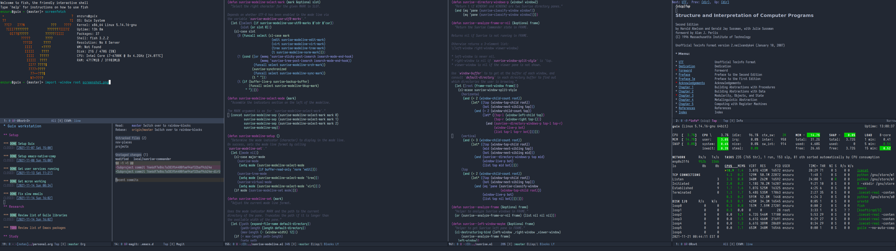

# Building a futuristic Lisp operating system

Through my eponymous nonprofit project [enzu.ru](https://enzu.ru), I am currently working on the [GNU operating system](https://www.gnu.org/) in order to create a [libre](https://www.gnu.org/philosophy/free-sw.html) Lisp-based workstation, built upon the [Guix System](https://guix.gnu.org) GNU/Linux distribution and [exwm window manager](https://github.com/ch11ng/exwm).

If in [POSIX](https://en.wikipedia.org/wiki/POSIX) everything is [truly a file](https://en.wikipedia.org/wiki/Everything_is_a_file), then [the logical conclusion](https://github.com/NetBSD/src/blob/trunk/doc/roadmaps/desktop#L259) is that the ideal POSIX desktop environment should be a file editor, and the only editor that can function as such is [GNU Emacs](https://www.gnu.org/software/emacs/).

My personal goal is to build an [introspective](https://www.gnu.org/software/guile/manual/html_node/Introspection.html), [hackable](https://www.gnu.org/philosophy/rms-hack.en.html), and [transactionable](https://guix.gnu.org/en/blog/2018/multi-dimensional-transactions-and-rollbacks-oh-my/) programming environment that is centered on [text-based user interfaces](https://en.wikipedia.org/wiki/Text-based_user_interface) instead of [graphical user interfaces](https://en.wikipedia.org/wiki/Graphical_user_interface), and that can be used [without a mouse](https://www.nongnu.org/ratpoison/inspiration.html).

This project exists to provide advanced hackers with a programming environment more reflective of their ethos and virtuosity. Most operating systems and desktop environments aim to fulfill the needs of the casual non-technical user; this project only aims to provide tools and documentation for advanced free software users who are willing to become fluent in Lisp.

The backend (operating system) is mostly defined in Scheme Lisp and the frontend (desktop environment) and its tools are mostly coded in Emacs Lisp. Both can be hacked live in a REPL, making it a pure expression of the free software ethic, and an incredibly powerful tool for an advanced programmer. I continue to progress on publishing documentation and tools for this rich computing style, a modern iteration of the [Lisp machines](https://en.wikipedia.org/wiki/Lisp_machine) of yore.

Follow me on GitHub to keep track of my contributions to various Lisp userspace codebases! Development on the GNU operating system itself is limited to the official mailing lists for each project.

Are you interested in having an advanced Lisp-based workstation that you can hack live to suit your needs? Getting started is easy:

- Install the [Guix System GNU/Linux distribution](https://guix.gnu.org)
- Modify my [Scheme code](https://github.com/enzuru/guix-profiles) and run them to setup your own user (you will need an Emacs directory with `exwm` and `geiser` installed and enabled; you can use mine to test drive)
- Log into the user and you will be booted into a fullscreen Emacs from which you can hack your operating system live with `(geiser)` and your window manager with `(eval-buffer)`, as well as launch other programs both within Lisp userspace and outside of it
